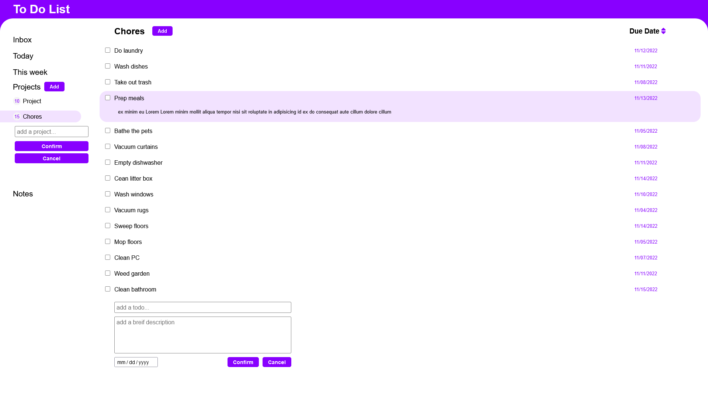

# to-do-list

- Use GitHub actions for auto-deployment
- Has localStorage set up
- Uses npm for devdependencies
- Uses webpack, babel for browser compatibility
- Makes use of module pattern
- Makes use of ES6 classes
- Create multiple to-do lists
- Create small notes
- Sort and filter dates

## Install

Run install script to get devdependencies
`npm install`

### Build

Creates new html, js, css files in dist folder
`npm run build`

### Development

Opens a new tab with live reload
`npm run dev`
